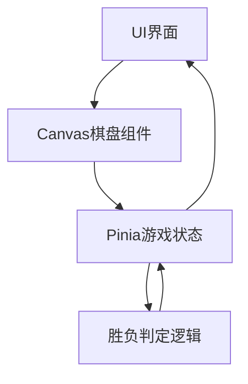
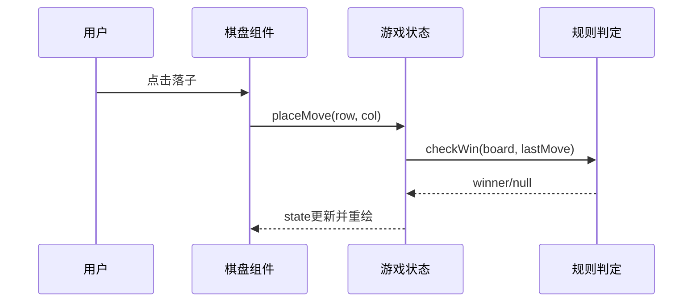

# 架构设计

## 总体架构

## 技术栈
- **后端:** 无
- **前端:** Vue 2.7 + Pinia 2 + Vite + Canvas 2D
- **数据:** 前端内存状态

## 核心流程

## 重大架构决策
完整的ADR存储在各变更的how.md中，本章节提供索引。

| adr_id | title | date | status | affected_modules | details |
|--------|-------|------|--------|------------------|---------|
| ADR-001 | 使用 Canvas 绘制棋盘 | 2026-01-19 | ✅已采纳 | ui-board, game-core | [链接](../history/2026-01/202601191531_gomoku_duel/how.md#adr-001-使用-canvas-绘制棋盘) |
